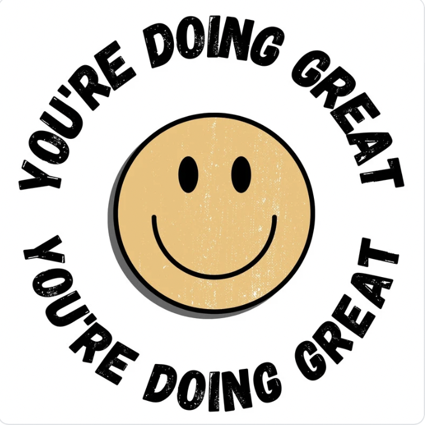

# World-Class CG Artist

 
     Hello everyone, 

     As a globally recognized CG artist with a deep expertise in artificial intelligence, I have an unwavering passion for art that has driven me throughout my career. With 13 years of software development experience, I’ve never let go of my CG art dreams. I’m proud to showcase my unique talents and characteristics as I relentlessly pursue my goals.        

     My interests span across concept design, original artwork painting, Blender 3D modeling, sculpting, rendering, and Unreal Engine 5.4. I’m particularly passionate about blending traditional Chinese ink painting with CG art. This fusion breathes new life into centuries-old Chinese artistry, creating something truly unique and innovative. 

     I’m eager to connect with CG artists from around the globe, engage in creative discussions, and explore diverse portfolios. I look forward to sharing my work and helping to build a healthy, harmonious, open, and inclusive CG art ecosystem. Together, we can push the boundaries of creativity. 

 
     Warmest Regards, 

 
     Jennifer Wu 

 
     (CG Artist) 

